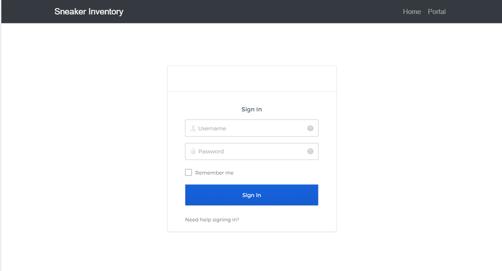
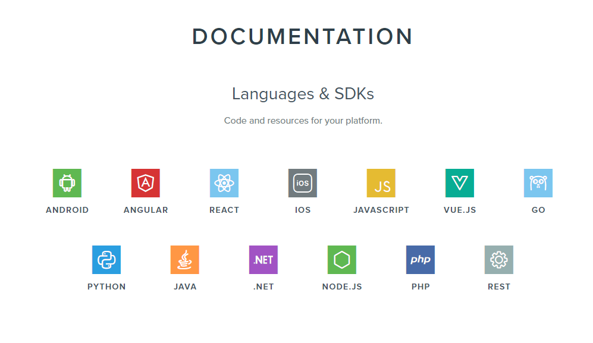
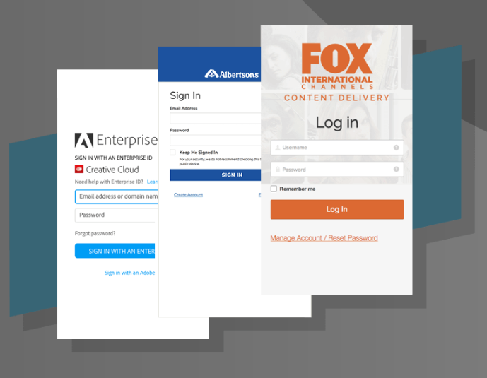
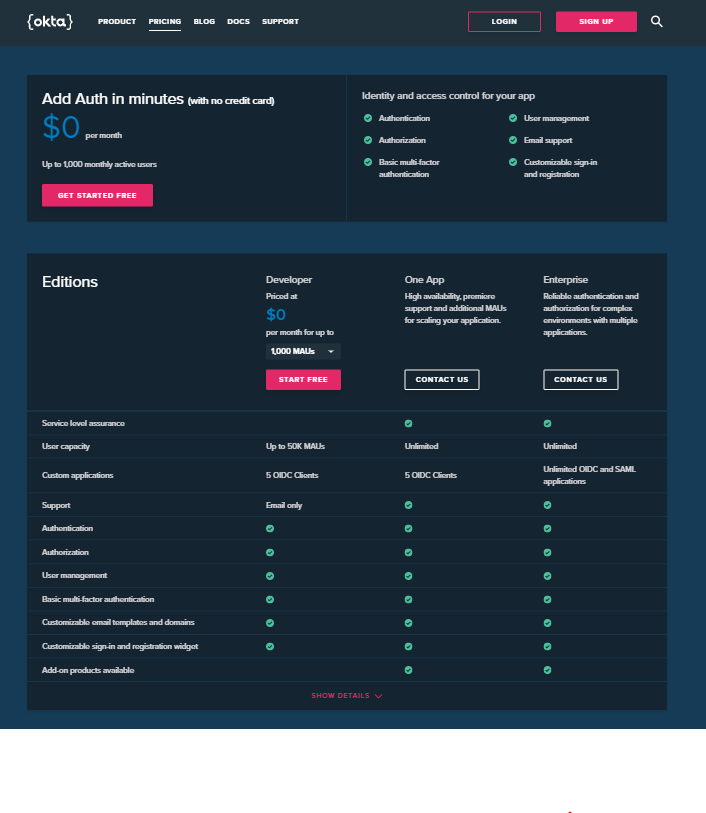

# Username/ Password Authentication using React
- This is a simple application of a username and password authentication using a third party application called OKLA.

## Table of contents
- [Why use OKLA?](##Why use OKLA?)
- [Install](##Install)
- [Dependencies](##Dependencies)
- [Technologies](##Technologies)
- [Demo](##Demo)
- [Author](##Author)
- [License](##License)


## Why use OKLA?
#### Building a Custom Authentication Experience for Your Application
- Authentication is a crucial part in developing any application. Whether you are developing an internal IT app for your employees, building a portal for your partners, or exposing a set of APIs for developers building apps around your resources, Okta provides the right authentication support for your projects.



- The sign-in experience is one of the most important user experiences any app developer needs to consider. To provide a seamless and attractive, yet secure authentication experience is not a trivial task. Typically, the sign-in logic accompanies other features such as password reset and registration. More importantly, enhanced security in the form of strong and adaptive authentication during the sign-in process is often critical to many implementations.

- Okta provides many options for developers to handle the authentication experience that are built on top of the underlying feature set in Okta. Password policies, strong and adaptive authentication policies, and password reset workflow can all be configured easily in the administrator UI. Many of these policies can also be controlled through Okta's API.

- OKLA supports multiple programming languages and SDK's



- Big companies uses OKLA as their authentication application. 


- For starters, OKLA is free and offers a lot of option.


## Install

``` javascript
npm install @okta/okta-signin-widget --save

npm install @okta/okta-react react-router-dom --save
```

## Quick Start

``` bash
# Install dependencies
npm install

# Serve on localhost:3000
npm start

# Build for production
npm run build
```

## Dependencies 

``` javascript
"dependencies": {
    "@okta/okta-react": "^1.4.1",
    "@okta/okta-signin-widget": "^2.21.0",
    "react": "^16.4.1",
    "react-dom": "^16.4.1",
    "react-router-dom": "^4.3.1",
    "react-scripts": "1.1.4"
  },
  "scripts": {
    "start": "react-scripts start",
    "build": "react-scripts build",
    "test": "react-scripts test --env=jsdom",
    "eject": "react-scripts eject"
  }

```

## App Info
#### Creating an accout
- Only the admin has the access to create a new user. The admin can also set up access level on specific user. 
- For authentication, a random password is sent to the user's email. The user can opt to change the password if needed. A link is provided to do this option. 
- All browsing history on the app is monitored via OKLA webiste. 
- Admin can monitor the traffic on the specific webiste. 

## Demo


For a video demo of this app please <a href="https://drive.google.com/file/d/1eDSKRQAmc2IHXGoJa4_wgPZwCiV5diBf/view"> -----click here ------  </a>

## Technologies
- React
- JavaScript
- CSS
- HTML5
- jQueary
- OKLA (third party application)

## Author
- Lloyd Marcelino
- webiste: lloydmarcelino@gmail.com
- github: https://github.com/ethanlloyd21

### License

This project is licensed under the MIT License
